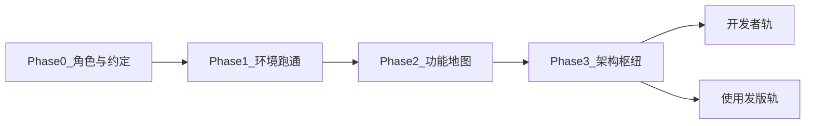
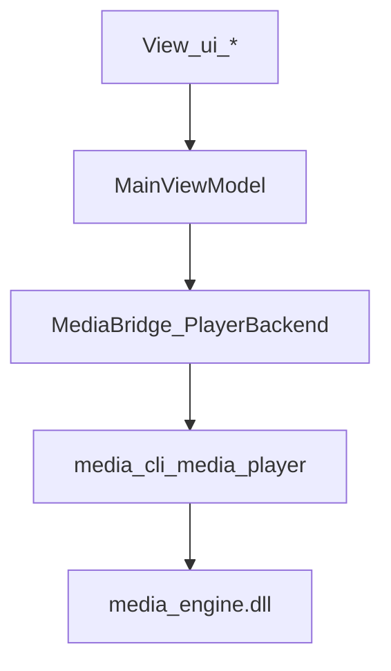

# MusicEditing 学习路径

> 给外人跟着走的**课程式**入口。专文真源仍在 [`design/`](design/)；本文只定顺序、对照表与验收点。  
> 总索引（按任务查）：[`README.md`](README.md)  
> **对外多期硬核课（PPT）**：[`course/README.md`](course/README.md)



| 阶段 | 读者 | 目标 | 大约时间 |
|------|------|------|----------|
| Phase 0 | 全员 | 知道读什么、不读什么 | 10 分钟 |
| Phase 1 | 全员 | x64 构建并跑通 UI | 30–90 分钟（含下载） |
| Phase 2 | 全员 | 菜单 ↔ 文档对照，点一遍功能 | 1–2 小时 |
| Phase 3 | 开发者必读；发版轨略读 §1–§2 | 理解分层与调用链 | 1–3 小时 |
| 开发者轨 | 准备改代码 | 完成一次小改 + 知如何同步文档 | 1 小时 |
| 使用/发版轨 | 打包上线 | 便携包 / 更新 / 卡密；知自备项 | 按环境 |

---

## Phase 0 — 角色与约定

### 文档真源

| 类型 | 路径 | 说明 |
|------|------|------|
| **实现真源** | [`design/`](design/) | 架构、链路、发版以这里为准 |
| **产品对照（只读）** | [根目录产品交互设计文档](../AI本地音视频处理工具-产品交互设计文档（开发落地版）.md) | 交互需求；与实现冲突时以 `design/` 为准 |
| **改功能同步规范** | [`.cursor/skills/music-editing-feature-docs/SKILL.md`](../.cursor/skills/music-editing-feature-docs/SKILL.md) | 改代码必须同步专文 + 枢纽状态表 |

### 日常推荐架构

- **x64**：`build_x64.bat` + `run_ui_x64.bat`（推荐）
- Win32 仍可用，但扩展 / OpenCV 预编译以 x64 为主（见根 [`README.md`](../README.md)）

### 不要当教程

| 路径 | 原因 |
|------|------|
| [`archive/`](archive/) | 历史/科普笔记，非当前实现 |
| `docs/log_*.txt`、`*cookies*.txt` | 本机调试产物（`.gitignore`），勿提交、勿当文档 |

---

## Phase 1 — 环境与跑通（必过）

### 环境要求（摘要）

- Windows 10/11 x64  
- Visual Studio 2022/2026（含「使用 C++ 的桌面开发」）  
- CMake 3.20+  
- Python 3.10+  
- 详见根 [`README.md`](../README.md)

### 推荐命令链

在仓库根目录：

```bat
scripts\setup_ffmpeg_x64.bat
build_x64.bat
pip install -r client\scripts\requirements.txt
run_ui_x64.bat
```

### 验收点（全部满足再进入 Phase 2）

- [ ] UI 窗口能打开  
- [ ] 首页能打开 `tests\test_video.mp4` 并播放  
- [ ] 存在 `build_x64\bin\Release\media_cli.exe`  
- [ ] 存在 `build_x64\bin\Release\media_player.exe`

### 可选模型（缺了也能开 UI，相关功能会提示）

| 用途 | 说明 |
|------|------|
| 放置约定 | [`models/README.md`](../models/README.md) |
| 超分 | `scripts\download_realesrgan_model.bat` |
| 去水印 LaMa | `scripts\download_lama_model.bat` |
| 演讲 ASR | `scripts\download_vosk_model.bat` |
| ExifTool | `scripts\download_exiftool.bat` |
| yt-dlp | `scripts\download_yt_dlp.bat` |

配置入口：`client/resources/config/app.conf`。

---

## Phase 2 — 功能地图（产品 → 菜单 → 文档）

菜单分组定义见 [`client/scripts/ui/workflow_link.py`](../client/scripts/ui/workflow_link.py)。  
业务链路真源：[feature_flows.md](design/feature_flows.md)。  
**做法**：点一次菜单 → 读对照表里那一节，**不要**一上来通读 feature_flows。

### 菜单对照表

| 菜单 | 页面 | 先读 |
|------|------|------|
| 核心 → 首页预览 | 首页 · 本地预览 | 枢纽 [implementation_flow.md](design/implementation_flow.md) 播放器相关；详解 [player_decode_flow.md](design/player_decode_flow.md) + [流程图/README.md](流程图/README.md) |
| 核心 → 智能切片 | 智能切片 | [feature_flows.md](design/feature_flows.md) §5.1 / §5.1.1 / §5.2（游戏）/ §5.5（成片·竖屏）/ §5.12（响度） |
| 核心 → 画质增强 | 画质增强 | §5.4 超分 · §5.10 补帧 · §5.13 LUT · §5.21 速度；UI 侧 [mvvm_and_ui.md](design/mvvm_and_ui.md) |
| 核心 → 去水印 | 去水印 | [mvvm_and_ui.md](design/mvvm_and_ui.md)；批量与角标见 [feature_flows.md](design/feature_flows.md) §5.18；队列内去水印见 §5.9.1 |
| 工作流 → 全流程队列 | 全流程队列 | §5.9 / §5.9.1 |
| 工作流 → 本地素材库 | 本地素材库 | §5.19 |
| 工作流 → 照片图库 | 照片图库 | §5.24 · [photo_manager.md](design/photo_manager.md) · [流程图](流程图/README.md) |
| 工作流 → 下载与热评 | 下载与热评 | §5.6 · §5.2.1 |
| 工作流 → BGM 混音 | BGM 混音 | §5.16 |
| 趣味 → 热评弹幕 | 同「下载与热评」页（聚焦热评子 Tab） | §5.2.1 |
| 趣味 → 封面工厂 | 封面工厂 | §5.14 |
| 趣味 → 音频趣味 / 梗音 | 音频趣味 | §5.15 |
| 趣味 → 溯源水印 | 溯源水印 | §5.22 |
| 帮助 → 个人中心 | 个人中心 | §5.17 · §5.18 向导 · [distribution.md](design/distribution.md) |

差异化入口说明：§5.20。工程质量（回归 / 诊断）：§5.23。

### Phase 2 小验收

- [ ] 能说出「智能切片」与「全流程队列」文档各在哪一节  
- [ ] 知道首页播放器详解不在 feature_flows，而在 `player_decode_flow.md`

---

## Phase 3 — 架构枢纽



### 固定阅读顺序

1. [implementation_flow.md](design/implementation_flow.md) **§1–§2**（架构图、编译产物、构建）  
2. [mvvm_and_ui.md](design/mvvm_and_ui.md)（View / ViewModel / Model、导航）  
3. [media_engine.md](design/media_engine.md)（C API、CLI、llama）  
4. 需要时：[player_decode_flow.md](design/player_decode_flow.md) + [流程图/README.md](流程图/README.md)  
5. [deps_and_extending.md](design/deps_and_extending.md)（依赖树、扩展）

- **查进度**：枢纽 **§3** 状态表（已实现 ✅）  
- **跑命令**：枢纽 **§4** 命令速查  

**发版轨**：读完 §1–§2 即可进入下方「使用 / 发版轨」；开发者继续读完 2–5。

---

## 开发者轨 — 第一次改功能

### 代码落点（常改）

| 层 | 路径 |
|----|------|
| 页面 View | `client/scripts/ui/*.py` |
| ViewModel | `client/scripts/viewmodels/main_vm.py` |
| 桥接 / 批处理 | `client/scripts/core/media_bridge.py` 等 |
| 配置 | `client/resources/config/app.conf` |
| C++ 引擎 | `client/src/`（经 `media_cli` / DLL） |

### 练习（不扩新功能范围）

1. 改一处 **UI 文案**（例如某页 `QLabel` 提示），或只改 `app.conf` **注释说明**  
2. 打开 [skill 清单](../.cursor/skills/music-editing-feature-docs/SKILL.md)：判断要不要动 `feature_flows.md` / 枢纽状态表（纯文案/注释通常不动状态表；行为或协议变更必须动）  
3. 跑回归短测：

```bat
scripts\run_regression_short.bat
```

或只跑与改动相关的 `tests\regression\test_*.py`。

### 开发者轨验收

- [ ] 知道改 UI / VM / Bridge / C++ 大致落在哪  
- [ ] 知道功能变更要同步哪类文档  

---

## 使用 / 发版轨

按顺序读专文即可，不必另找教程。

| 步 | 文档 / 脚本 | 做什么 |
|----|-------------|--------|
| 1 | [release_checklist.md](design/release_checklist.md) §1–§2 | 回归短测 + 确认 x64 引擎产物 |
| 2 | [distribution.md](design/distribution.md) | `pack_portable` / `accept_portable` / `build_installer` |
| 3 | distribution **§5–§6** | 更新通道：`publish_update_manifest.py` / `serve_update_channel.py`；**发版包勿留 `127.0.0.1` 联调 URL** |
| 4 | distribution + [`scripts/license_server/`](../scripts/license_server/) | 试用 / 卡密 / 可选激活服 / 购买页 URL |
| 5 | distribution **§6** 表 | 对照「必须自备」项 |

常用命令（仓库根）：

```bat
python scripts\pack_portable.py --profile slim --zip
python scripts\accept_portable.py
scripts\build_installer.bat
python scripts\publish_update_manifest.py --version 0.2.0 --notes "说明" --base-url https://你的CDN/me/
```

一键发版入口（若环境齐）：`scripts\release_oneclick.bat` / `release_oneclick.py`。

### 必须自备（仓库代劳不了）

与 [distribution.md §6](design/distribution.md) 一致：

| 项 | 说明 |
|----|------|
| 干净机手测 | 另台 Win 解压/安装，SmartScreen / VC++ |
| CDN | 上传 `dist/update/`，客户端填正式 `update_manifest_url` |
| 代码签名证书 | `MUSIC_CODE_SIGN_THUMBPRINT` + `pack --sign` |
| 外部收银台 | 店外收款后发卡；`license_purchase_url` |

### 发版轨验收

- [ ] 本机 `accept_portable` 能 PASS  
- [ ] 说得出更新 manifest 与购买页各配在哪  
- [ ] 知道四件「必须自备」是什么  

---

## 收尾 — 文档怎么维护

1. **改功能** → 跟 [skill](../.cursor/skills/music-editing-feature-docs/SKILL.md) 勾清单  
2. **查已实现 / 待办** → [implementation_flow.md](design/implementation_flow.md) §3  
3. **第三方与模型** → 下表（各目录自有 README）

| 路径 | 内容 |
|------|------|
| `third_party/ffmpeg/README.md` | FFmpeg x86 / x64 |
| `third_party/opencv/README.md` | OpenCV 导入 |
| `third_party/onnxruntime/README.md` | ONNX Runtime |
| `third_party/opengl/README.md` | GLEW |
| `third_party/yt-dlp/README.md` | yt-dlp |
| `third_party/exiftool/README.md` | ExifTool |
| `models/README.md` | 模型放置 |

设计专文地图：[design/README.md](design/README.md)。
