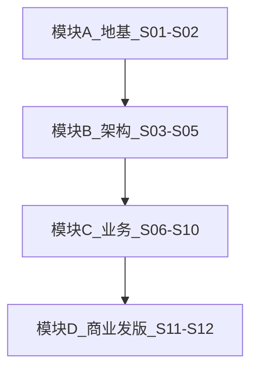

# MusicEditing 硬核实战课（对外讲课）

> 面向愿意付费深度学习的工程向学员。  
> **课件 PPT**：本目录 `pptx/`（由 `scripts/build_course_pptx.py` 生成）  
> **配套文档真源**：[`../design/`](../design/) · 自学路径 [`../LEARNING.md`](../LEARNING.md)

---

## 课程定位（卖点话术可直接用）

| 维度 | 内容 |
|------|------|
| 不是什么 | 不是「拖拽剪映」入门；不是空洞架构 PPT |
| 是什么 | **可跑仓库 + 可改代码 + 可打包上线** 的完整交付链路 |
| 技术栈 | C++ FFmpeg 引擎 · Python/PySide6 MVVM · ONNX · 便携分发 · 卡密商业化 |
| 产出 | 学员能独立：跑通 UI、改一条业务链路、打 slim 包、讲清更新/授权边界 |
| 建议课时 | **12 期 × 90–120 分钟**（可压缩为 8 期加餐，或拆成 16 期精讲） |
| 建议作业 | 每期 Lab + 期末「小功能 + 文档同步 + 验收」 |

---

## 分册地图



| 模块 | 期数 | 主题 |
|------|------|------|
| A 地基 | S01–S02 | 产品全景、仓库地图、x64 硬核跑通 |
| B 架构 | S03–S05 | MVVM/UI、media_engine/CLI、播放器 IPC/SHM |
| C 业务 | S06–S10 | 切片、超分、去水印/队列、下载热评、趣味扩展 |
| D 商业 | S11–S12 | 试用卡密、打包 Inno、更新通道、签名与验收 |

---

## 课表（详细）

| 期 | 标题 | 核心硬核点 | 课后 Lab | 对照文档 |
|----|------|------------|----------|----------|
| **S01** | 开班：本地 AI 音视频工具怎么做成「能卖的产品」 | 离线边界、模块地图、实现真源 vs 产品稿 | 画一张自己的「菜单→价值」图 | 产品交互稿 · LEARNING Phase0 |
| **S02** | 仓库手术刀：从 clone 到 `run_ui_x64` | FFmpeg/OpenCV/CMake、产物清单、常见翻车 | 本机跑通并截图四验收点 | README · implementation_flow §2 |
| **S03** | PySide6 MVVM 与 Studio 页体系 | Signal/Slot、懒加载页、`workflow_link`、滚动壳 | 改一处文案并说明要不要改文档 | mvvm_and_ui · skill |
| **S04** | C++ 引擎与 CLI 协议 | `media_engine.dll` / `media_cli`、stdout 协议、ctypes 优先 | 用 CLI 跑一次 probe/thumbnail | media_engine |
| **S05** | 播放器硬核：子进程、SHM、Seek | PlayerBackend IPC、双缓冲、异步 Seek | 对照流程图口述一帧路径 | player_decode_flow · 流程图 |
| **S06** | 智能切片与高光 | 演讲/游戏/响度、时间轴缩略图、竖屏成片 | 手动切片 + 导出一段 | feature_flows §5.1–5.5 |
| **S07** | 画质增强：超分 / 补帧 / LUT / CUDA | OpenCV vs Real-ESRGAN、tile、试跑秒数 | 对短视频跑 OpenCV 2× | feature_flows §5.4/10/13/21 |
| **S08** | 去水印与全流程队列 | 角标预设、批量重试、有限并行与串行 GPU | 配一队列只跑切片+超分试跑 | §5.9 / §5.18 |
| **S09** | 下载、热评、成片模板 | yt-dlp Cookie、ASS 风格、发布预设 | 配置 Cookie 文件路径并理解失败文案 | §5.2.1 / §5.6 |
| **S10** | 趣味扩展包 | 封面工厂、音频梗音、BGM/Demucs、溯源水印 | 生成一张封面 PNG | §5.14–5.16 / §5.22 |
| **S11** | 商业闭环 | trial_policy、卡密、激活服、购买页边界 | 本地起 license_server 兑一张演示卡 | distribution · §5.17 |
| **S12** | 发版毕业课 | slim/standard/full、accept、Inno、更新 manifest、签名自备项 | 打 slim zip + accept PASS + 写上线检查表 | release_checklist · distribution §5–6 |

---

## 学员须知

1. **系统**：Windows 10/11 x64；需能装 VS C++ 工作负载。  
2. **先自学**：[`LEARNING.md`](../LEARNING.md) Phase 0–1，上课不从装 Python 讲起（S02 会复盘翻车点）。  
3. **仓库真源**：以 `docs/design/` 为准；`docs/archive/` 不是教材。  
4. **期末标准**：能讲解「View→VM→Bridge→CLI/Player→DLL」；能指出试用与正式版差异；能说明 CDN/证书/收银台为何仓库代劳不了。

---

## 生成 / 更新 PPT

```bat
python scripts\build_course_pptx.py
```

输出（ASCII 文件名，避免乱码）：

| 文件 | 内容 |
|------|------|
| `pptx/00.pptx` | 课程总览 |
| `pptx/S01.pptx` … `pptx/S12.pptx` | 各期课件 |

讲稿级要点（讲师备注）：[`sessions/`](sessions/) 下按期 Markdown。

---

## 与仓库其它文档关系

| 文档 | 用途 |
|------|------|
| 本目录 | **对外讲课 / 卖课大纲 + PPT** |
| [`LEARNING.md`](../LEARNING.md) | 自学跟练路径（更短） |
| [`design/`](../design/) | 实现真源（上课引用，不替代课件） |
