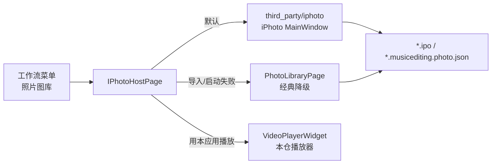
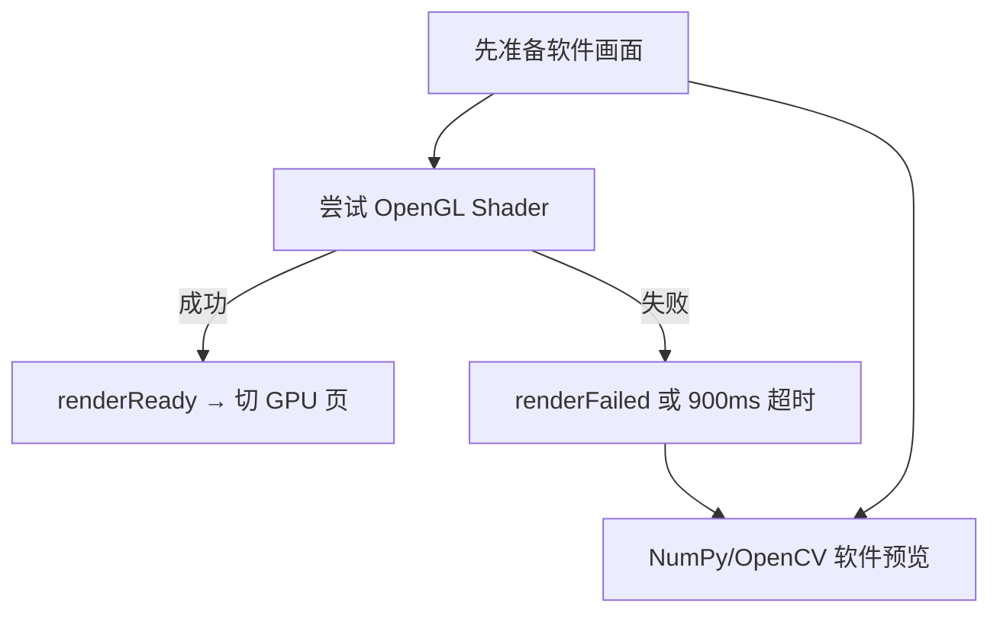

# 本地照片管理器架构与非破坏编辑方案

> 状态：**主路径已嵌入上游 iPhotron（vendor）**；经典 `PhotoLibraryPage` 保留为降级。  
> 相关：[MVVM 与 UI](mvvm_and_ui.md) · [媒体引擎](media_engine.md) · [依赖与扩展](deps_and_extending.md) · [业务链路 §5.24](feature_flows.md) · [流程图总览](../流程图/README.md) · [third_party/iphoto/README.md](../../third_party/iphoto/README.md)

## 0. 总览图（速览）



更完整的扫描时序与双渲染路径见 [流程图/README.md §2](../流程图/README.md)。

## 0.1 与上游 iPhotron 的关系

| 项 | 说明 |
|----|------|
| 源码位置 | `third_party/iphoto/src/iPhoto`（MIT，上游 [iPhotron](https://github.com/OliverZhaohaibin/iPhotron-LocalPhotoAlbumManager)） |
| 注入 | `core/iphoto_bootstrap.py` 把 vendor `src` 加入 `sys.path`，并为 Py3.10 补 `enum.StrEnum` |
| UI 宿主 | `ui/iphoto_host_page.py`：嵌入 `MainWindow`（失败则 Tool 子窗口 / 经典图库） |
| 地图 | `third_party/iphoto/src/maps` 仅 Python；font / OBF 扩展见 `maps/ASSETS.md` |
| **播放器边界** | **不修改** `VideoPlayerWidget` / `media_player.exe`。详情页 Live 可用 iPhoto 自带 `VideoArea`；需要进本应用工作流时用宿主栏「用本应用播放 / 图片增强 / 去水印」回调 |
| 依赖 | 核心：`requirements.txt`；完整图库：`requirements-iphoto.txt`（勿塞进每次 `run_ui` 的默认 pip） |
| 启动 | 默认**嵌入**；大图 SoftImageViewer；地点地图在宿主下强制 CPU + QWidget 照片标记叠层（避免 GL 后绘空白）；经典/iPhotron 可互切 |

经典路径（`PhotoLibraryPage` + `services/photo_library_service.py` + `core/photo_*`）仍保留：Folder-native、SQLite、简化 sidecar v2、GL/NumPy 编辑对话框。

## 1. 目标与边界

照片管理器采用 **Folder-native（文件夹即相册）**：不导入到封闭仓库、不移动原文件、不后台上传照片或坐标。全局 SQLite 只保存可重建索引；编辑参数保存在原图旁路 JSON 中。

实现借鉴 macOS Photos/Lightroom 的交互原则与公开架构思想，但代码和数据格式为 MusicEditing 独立实现。现有底层完全复用：

- 图片解码：`core/image_loader.py`（OpenCV → Qt 回退）
- 视频探测/缩略图：`MediaBridge` → C++ DLL / `media_cli` → FFmpeg
- 视频播放：`VideoPlayerWidget` → `media_player.exe`
- 图片增强/去水印：现有 OpenCV / ONNX Runtime / C++ API
- 元数据：ExifTool；不可用时降级为文件时间

## 2. 分层结构

```text
UI / Qt
  photo_library_page.py      网格、检查器、智能相册入口
  photo_edit_dialog.py       编辑控件、GPU/软件显示切换
  background_task_manager.py QThreadPool、取消、按 key 去旧任务
          │
Services（无 Qt 控件）
  services/photo_library_service.py
          │
Pure Python domain/core
  photo_album.py             Folder-native 相册描述
  photo_library_index.py     SQLite、迁移、查询、Upsert
  photo_metadata.py          ExifTool JSON 标准化
  photo_sidecar.py           非破坏编辑配方
  photo_edit_math.py         Gaussian/投影/凸多边形/AABB
  photo_numpy_renderer.py    CPU 参考渲染与 GL 回退
          │
Existing native/toolchain
  MediaBridge / media_cli / media_engine / FFmpeg / OpenCV
```

约束：`core/photo_*` 不引用 Qt；页面不直接执行 SQL、ExifTool 或 FFmpeg；Qt 线程对象只存在于 UI 基础设施层。

## 3. Folder-native 与索引

### 3.1 相册描述

每个用户添加的根目录包含：

```text
<album>/.musicediting.album.json
```

字段为 `schemaVersion/title/createdAt/updatedAt/coverPath/description`。写入采用同目录临时文件 + `os.replace`，进程崩溃不会留下半份正式 JSON。无效或高版本文件不会被覆盖。

### 3.2 SQLite

数据库默认位于 `%LOCALAPPDATA%/MusicEditing/photo_library.sqlite3`，启用 WAL、20 秒 busy timeout 与渐进式列迁移。主要索引：

- 路径主键：幂等 Upsert
- `captured_at DESC`：时间线
- `kind + captured_at`：照片/视频
- `favorite`、`edited`、`live_photo`：智能相册
- `latitude + longitude`：地点照片

扫描以 `path + size + mtime + kind` 判断变化。仅变化项进入 ExifTool；完整遍历后才删除该根目录的失效记录。取消发生时不执行缺失项清理，避免把未扫描到的后半目录误判为删除。

### 3.3 结构化元数据

`photo_metadata.read_photo_metadata()` 批量调用 ExifTool `-j -n`，标准化：

- `DateTimeOriginal/CreateDate/MediaCreateDate`
- GPS 纬度、经度
- Make/Model、宽高
- Apple ContentIdentifier

ExifTool 缺失或单批失败不会阻断扫描，降级使用文件修改时间。

## 4. 异步与服务层

`BackgroundTaskManager` 基于 `QThreadPool/QRunnable`：

- key 相同的新任务自动取消旧令牌；旧任务完成不能清除新任务
- 支持 `cancel(key)`、`cancel_prefix()`、`cancel_all()`
- 结果/错误通过 Qt Signal 回主线程
- 页面刷新时取消旧代缩略图，generation 再次拦截过期结果

`PhotoLibraryService` 封装根目录、扫描、查询、收藏、sidecar 状态和视频缩略图。UI 仅负责编排，不直接依赖 SQLite 细节。缩略图最多 4 个工作线程；照片通过 `QImageReader` 预读，视频复用 `MediaBridge.extract_thumbnail()` 的 DLL→CLI 回退与磁盘缓存。

## 5. Live Photo 与智能相册

Live Photo 配对优先使用 Apple ContentIdentifier；没有标识符时先按“规范化父目录 + 文件 stem”精确匹配，再对尚未配对、同目录且拍摄时间相差不超过 2 秒的照片与视频执行一对一最近邻匹配。可信 ContentIdentifier 不参与时间兜底，避免错误覆盖标识符关系。当前实现覆盖识别、标记和筛选；沉浸式预览中的按压播放可继续复用现有视频播放器实现。

内置智能相册由 SQLite 条件动态生成：照片、视频、收藏、已编辑、Live Photo、地点照片。它们不是复制出来的目录，资产状态变化后查询结果自动更新。

## 6. 非破坏编辑

### 6.1 Sidecar

每张已编辑照片旁新增：

```text
<photo.ext>.musicediting.photo.json
```

v2 配方保存 `master_light/master_color/exposure/contrast/saturation/temperature/perspective_horizontal/perspective_vertical/rotation`，并记录源文件绝对路径、大小和纳秒 mtime。源文件变化后旧配方保留但标记为非当前，不会静默套到不同内容。v1 sidecar 可向后读取。

### 6.2 Gaussian Master Sliders

大师滑块不是简单地给全部参数加同一个值。`photo_edit_math.gaussian_weights()` 对细分参数位置计算：

```text
w_i = exp(-0.5 * ((x_i-focus)/sigma)^2) / Σw
```

光效大师平滑分配到曝光/对比度；色彩大师分配到饱和度/色温。`resolve_master_adjustments()` 是 GPU、NumPy 和未来导出的统一解析入口，避免预览与成片参数含义不一致。

### 6.3 双渲染路径与黑屏回退



```text
QImage
 ├─ OpenGL 3.3 Shader：曝光/对比度/饱和度/色温实时预览
 └─ NumPy/OpenCV：同公式 CPU 渲染 + 透视/旋转/安全裁剪
```

编辑器先准备软件画面，再尝试 OpenGL。Shader、VAO/VBO、纹理或上下文失败时通过 `renderFailed` 自动切换软件预览；900ms 未 ready 也触发回退。因此远程桌面、虚拟机、旧驱动或 Qt 软件 GL 环境不再显示空白。OpenGL 成功后 `renderReady` 才切换 GPU 页面。透视或旋转开启时主动使用 NumPy/OpenCV 路径。

## 7. 坐标系与无黑边裁剪

系统维护三套坐标：

1. **原始纹理空间**：源像素 `(0..W, 0..H)`。
2. **投影空间**：透视矩阵作用后的凸四边形 `Q_valid`。
3. **视口空间**：编辑器控件显示坐标，仅用于交互映射。

`projected_quad()` 生成有效四边形；`point_in_convex_polygon()` 使用叉积符号做凸多边形包含测试。`safe_aabb_in_quad()` 固定原图宽高比，对中心 AABB 半宽执行 48 次二分：只有四个裁剪角都位于 `Q_valid` 内才扩大。最终流程：

```text
原图 → perspective/rotation → 透明边界图
    → 最大安全 AABB（四角全部在 Q_valid 内）
    → crop → resize 回预览尺寸
```

这保证导出的裁剪矩形不会采样投影四边形之外的透明/黑色区域。几何函数只依赖 NumPy，可独立验证并由未来 OpenGL homography 与导出器共同调用。

## 8. UI 与 macOS 风格

照片页为三栏结构：左侧图库/智能相册，中间自适应懒加载网格，右侧元数据与动作检查器。图库“打开预览”支持鼠标滚轮缩放、放大后按住左键拖动画面、双击恢复适合窗口；拖拽仅在这个纯看图窗口启用。非破坏编辑画布只支持滚轮及 `− / + / 适合窗口` 控件缩放，不启用拖拽。两处缩放范围均为适合窗口比例的 25%–400%，编辑器的 GPU 与 NumPy 软件预览共享同一缩放状态。视觉令牌位于 `ui/theme.py`：暖白背景、白色内容面、发丝边、系统蓝强调、圆角控件；Windows 使用 Segoe UI Variable/微软雅黑回退，不依赖 macOS 专有字体。

网格在 resize 时按 viewport 宽度计算列数、单元宽度和 0.72 缩略图宽高比。只更新可调度批次，旧 generation 任务结果不会污染新查询。

GPS 默认只在本地索引。只有用户点击“在地图中查看”时才把单个坐标交给浏览器。完整离线 MapLibre/PBF 模块属于独立扩展，不应耦合图库数据库。

## 9. 数据安全与隐私

- 添加/移除图库只改变描述和索引，不删除媒体。
- 非破坏编辑不写原图像素、不写 EXIF。
- JSON 均原子替换；SQLite 使用事务/WAL。
- Exif/GPS、缩略图和编辑配方默认留在本机。
- 在线地图只能由明确点击触发。
- “最近删除”未来必须实现应用回收站和恢复期，不直接调用永久删除。

## 10. 当前状态与后续扩展

已实现：

- **主路径**：vendor 嵌入 iPhotron（完整图库网格 / 胶片条 / 详情 / 编辑侧栏 / Live 配对 / HEIC 依赖路径 / 回收站等上游能力，随上游包演进）
- **宿主桥**：`IPhotoHostPage` + 本仓播放/增强/去水印回调；「经典图库」一键降级
- **经典路径**：Folder-native、SQLite、ExifTool/GPS、智能相册、Live 匹配、v2 sidecar、Gaussian 大师滑块、OpenGL/NumPy、透视安全 AABB

后续扩展：

1. 宿主栏稳定暴露当前选中路径（已接 `MainWindow.current_selection` / detail VM）；可选把「发送到首页播放」挂到 iPhoto 菜单。
2. 同步安装可选依赖（`pillow-heif`、`mapbox-vector-tile`、`rawpy` 等）写入便携包清单。
3. 按需补齐 `maps/font` 与 OBF 扩展，启用离线地图（见 `ASSETS.md`）。
4. 经典路径：自定义智能相册、导出器消费 sidecar、透视 GPU uniform（仅在不走 iPhoto 编辑时仍有价值）。
5. 记录 vendor 对应上游 tag/commit，建立更新脚本。

## 11. 验证清单

- 同一目录重复扫描：第二次 `changed=0`。
- 修改 size/mtime：仅该资产重新读元数据。
- 扫描取消：不清理未遍历文件。
- 正常 GPU：编辑器显示 `GPU 实时预览`。
- 无 OpenGL/远程桌面：900ms 内切换 NumPy 软件画面，滑块仍可用。
- 保存后原图哈希不变，sidecar 存在；重新打开恢复参数。
- 透视极值下预览无黑边；安全 AABB 四角均通过凸多边形测试。
- 页面刷新/关闭后旧缩略图结果不写入当前网格。
