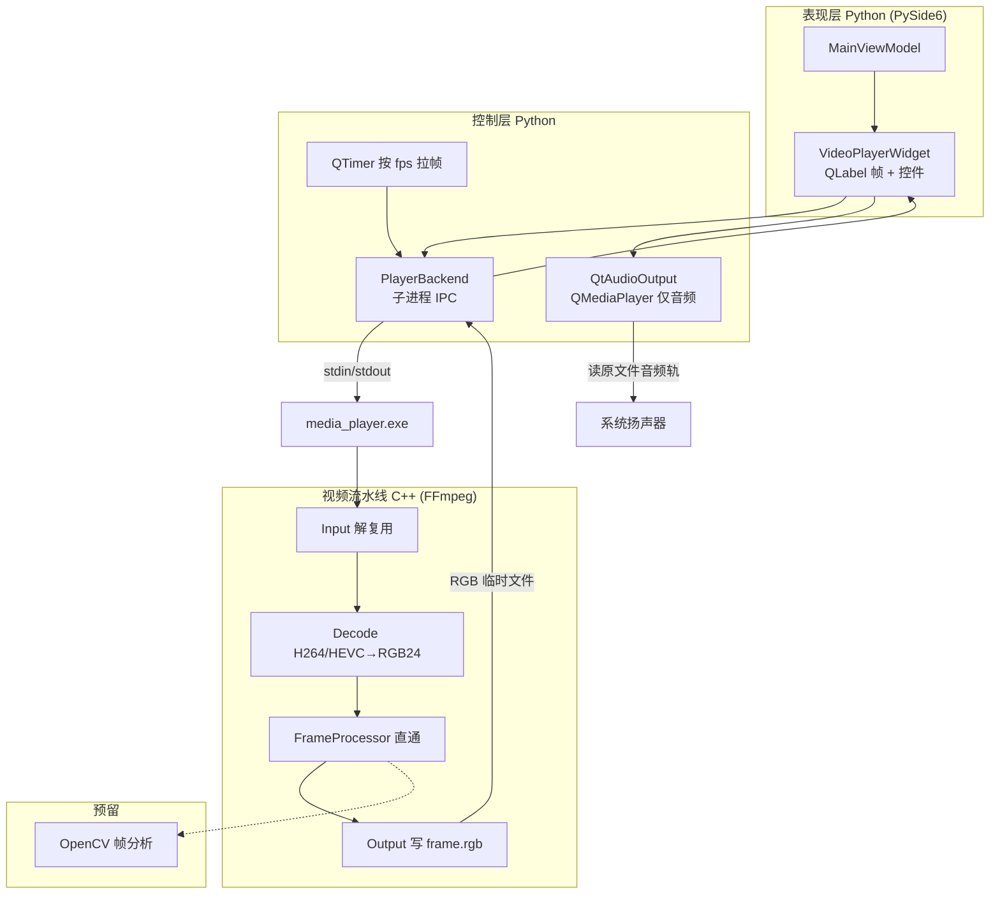

# 音视频处理流程图（项目落地版）

> 依据 `docs/音视频的流程.txt` 三层架构  

> **详细解码说明见：** [`docs/design/player_decode_flow.md`](../design/player_decode_flow.md)

## 总体数据流

## 分层职责

| 层级 | 技术 | 职责 |

|------|------|------|

| 表现层 | PySide6 | 进度条、按钮、QLabel 显示 RGB 帧 |

| 控制层 | Python | 播放状态、seek、定时拉帧、**音视频 seek 同步** |

| 视频解码 | C++ FFmpeg | 解封装、解码、swscale → RGB24 |

| 音频播放 | Qt Multimedia | 系统解码音频轨，不经过 C++ |

| 处理 | FrameProcessor | OpenCV 预留，当前直通 |

## 数据存放（摘要）

| 类型 | 存放位置 | 格式 |

|------|----------|------|

| 视频帧 | `%TEMP%\me_player_*\frame.rgb` | 裸 RGB24，每帧覆盖 |

| UI 图像 | Python QImage/QPixmap | 内存 |

| 音频 | 不落地 | Qt 内部 PCM → 声卡 |

## 统一播放器

全应用共用 **`VideoPlayerWidget`**：

- 首页预览

- 智能切片页导入后自动同步加载

- 打开视频 → `ViewModel.import_video`

## IPC 协议（media_player.exe）

**命令（stdin）：** `OPEN` / `SEEK` / `NEXT` / `PAUSE` / `RESUME` / `QUIT`

**响应（stdout）：** `OPEN_OK` / `FRAME_OK` / `SEEK_OK` / `FRAME_EOF` / `ERROR`

详见 `player_decode_flow.md` §6。

## 退出清理

关闭主窗口时必须：`QTimer.stop` → Qt 音频 `stop` → `kill media_player.exe` → `QApplication.quit`

