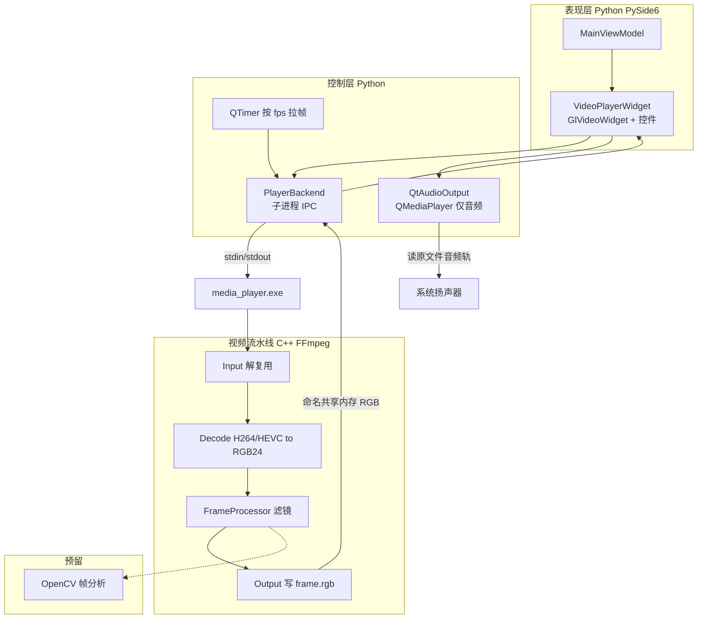
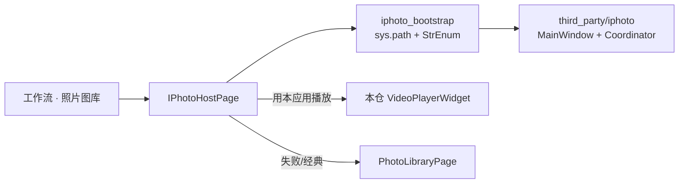
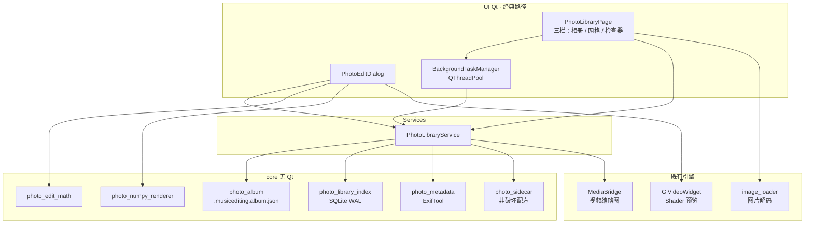
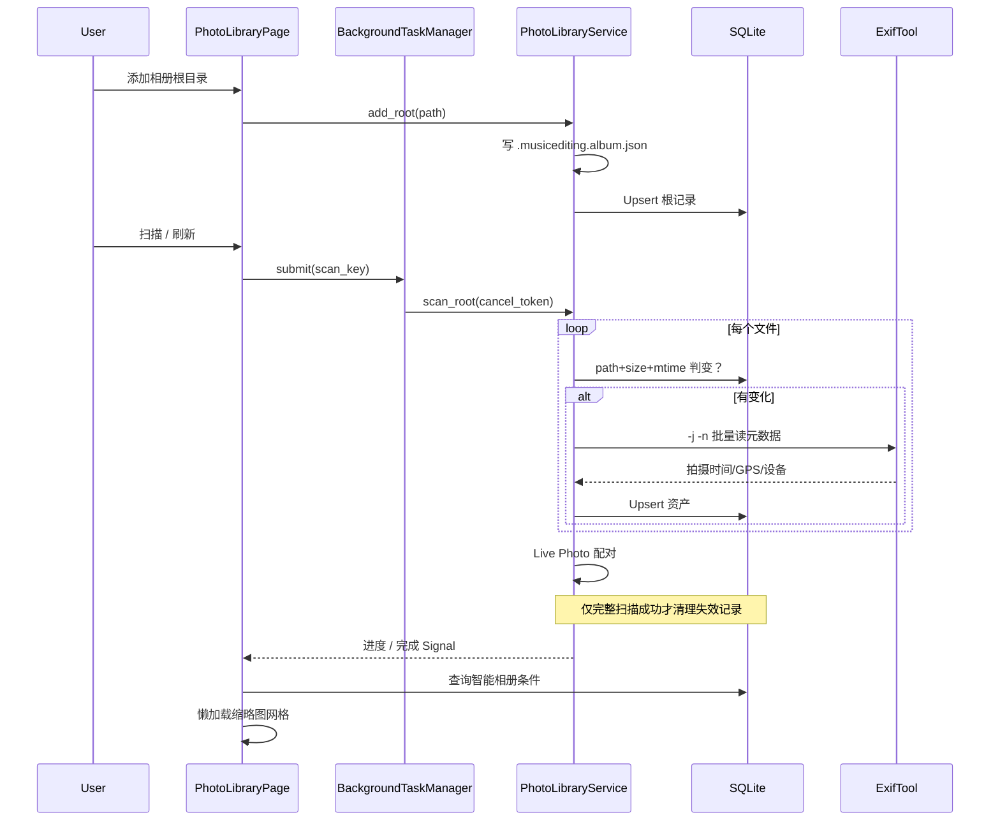
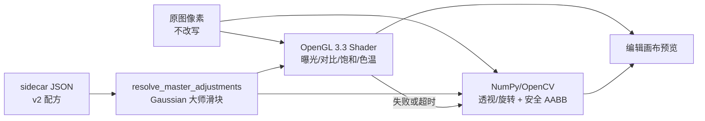

# 流程图总览（项目落地版）

> 对齐当前实现。  
> **播放器详解：** [player_decode_flow.md](../design/player_decode_flow.md)  
> **照片图库详解：** [photo_manager.md](../design/photo_manager.md) · 业务链路 [feature_flows.md §5.24](../design/feature_flows.md)

架构示意（播放器，可选）：[流程图.png](流程图.png)

---

## 1. 播放器总体数据流

```mermaid
flowchart TB
    subgraph UI["表现层 Python PySide6"]
        Widget["VideoPlayerWidget\nGlVideoWidget + 控件"]
        VM["MainViewModel"]
    end

    subgraph CTRL["控制层 Python"]
        Backend["PlayerBackend\n子进程 IPC"]
        QtAudio["QtAudioOutput\nQMediaPlayer 仅音频"]
        Timer["QTimer 按 fps 拉帧"]
    end

    subgraph VIDEO["视频流水线 C++ FFmpeg"]
        Input["Input 解复用"]
        Decode["Decode H264/HEVC to RGB24"]
        Process["FrameProcessor 滤镜"]
        Output["Output 写 frame.rgb"]
    end

    subgraph RESERVE["预留"]
        OpenCVExtra["OpenCV 帧分析"]
    end

    Widget --> Backend
    Widget --> QtAudio
    VM --> Widget
    Timer --> Backend
    Backend -->|stdin/stdout| PlayerExe["media_player.exe"]
    PlayerExe --> Input --> Decode --> Process --> Output
    Process -.-> OpenCVExtra
    Output -->|命名共享内存 RGB| Backend --> Widget
    QtAudio -->|读原文件音频轨| Speaker["系统扬声器"]
```

### 分层职责（播放器）

| 层级 | 技术 | 职责 |
|------|------|------|
| 表现层 | PySide6 | 进度条、按钮、`GlVideoWidget` 显示 RGB 帧 |
| 控制层 | Python | 播放状态、seek、定时拉帧、音视频 seek 同步 |
| 视频解码 | C++ FFmpeg | 解封装、解码、swscale → RGB24 |
| 音频播放 | Qt Multimedia | 系统解码音频轨，不经过 C++ |
| 处理 | FrameProcessor | OpenCV 滤镜（可关）；分析能力预留 |

### 数据存放（摘要）

| 类型 | 存放位置 | 格式 |
|------|----------|------|
| 视频帧 | 命名共享内存 `MusicEditing_rgb_*`（首选） | 裸 RGB24 |
| 视频帧（回退） | `%TEMP%\me_player_*\frame.rgb` | 裸 RGB24，每帧覆盖 |
| UI 图像 | Python QImage / OpenGL 纹理 | 内存 |
| 音频 | 不落地 | Qt 内部 PCM → 声卡 |

### 统一播放器

全应用共用 **`VideoPlayerWidget`**：

- 首页预览
- 智能切片页导入后自动同步加载
- 打开视频 → `ViewModel.import_video`

IPC 命令与响应协议见 [player_decode_flow.md §6](../design/player_decode_flow.md)。

### 退出清理

关闭主窗口时：`QTimer.stop` → Qt 音频 `stop` → `kill media_player.exe` → `QApplication.quit`（详见播放器专文）。

---

## 2. 照片图库数据流

菜单：工作流 → **照片图库**（`TAB_PHOTOS=12`）。

### 2.0 主路径：嵌入 iPhotron

```mermaid
flowchart LR
    Menu["工作流 · 照片图库"]
    Host["IPhotoHostPage"]
    Boot["iphoto_bootstrap\nsys.path + StrEnum"]
    Vendor["third_party/iphoto\nMainWindow + Coordinator"]
    MEPlay["本仓 VideoPlayerWidget"]
    Legacy["PhotoLibraryPage"]

    Menu --> Host
    Host --> Boot --> Vendor
    Host -->|"用本应用播放"| MEPlay
    Host -->|失败/经典| Legacy
```

### 2.1 经典降级：分层与扫描

```mermaid
flowchart TB
    subgraph UILayer["UI Qt · 经典路径"]
        Page["PhotoLibraryPage\n三栏：相册 / 网格 / 检查器"]
        Edit["PhotoEditDialog"]
        Tasks["BackgroundTaskManager\nQThreadPool"]
    end

    subgraph Svc["Services"]
        LibSvc["PhotoLibraryService"]
    end

    subgraph Domain["core 无 Qt"]
        Album["photo_album\n.musicediting.album.json"]
        Index["photo_library_index\nSQLite WAL"]
        Meta["photo_metadata\nExifTool"]
        Side["photo_sidecar\n非破坏配方"]
        Math["photo_edit_math"]
        Np["photo_numpy_renderer"]
    end

    subgraph Native["既有引擎"]
        Bridge["MediaBridge\n视频缩略图"]
        ImgLoad["image_loader\n图片解码"]
        GL["GlVideoWidget\nShader 预览"]
    end

    Page --> Tasks
    Page --> LibSvc
    Edit --> LibSvc
    Tasks --> LibSvc
    LibSvc --> Album
    LibSvc --> Index
    LibSvc --> Meta
    LibSvc --> Side
    Edit --> Math
    Edit --> Np
    Edit --> GL
    LibSvc --> Bridge
    Page --> ImgLoad
```

### 2.2 添加根目录 → 扫描 → 网格

```mermaid
sequenceDiagram
    participant User
    participant Page as PhotoLibraryPage
    participant BTM as BackgroundTaskManager
    participant Svc as PhotoLibraryService
    participant DB as SQLite
    participant Exif as ExifTool

    User->>Page: 添加相册根目录
    Page->>Svc: add_root(path)
    Svc->>Svc: 写 .musicediting.album.json
    Svc->>DB: Upsert 根记录
    User->>Page: 扫描 / 刷新
    Page->>BTM: submit(scan_key)
    BTM->>Svc: scan_root(cancel_token)
    loop 每个文件
        Svc->>DB: path+size+mtime 判变？
        alt 有变化
            Svc->>Exif: -j -n 批量读元数据
            Exif-->>Svc: 拍摄时间/GPS/设备
            Svc->>DB: Upsert 资产
        end
    end
    Svc->>Svc: Live Photo 配对
    Note over Svc,DB: 仅完整扫描成功才清理失效记录
    Svc-->>Page: 进度 / 完成 Signal
    Page->>DB: 查询智能相册条件
    Page->>Page: 懒加载缩略图网格
```

### 2.3 非破坏编辑预览路径

```mermaid
flowchart LR
    Src["原图像素\n不改写"]
    Recipe["sidecar JSON\nv2 配方"]
    Resolve["resolve_master_adjustments\nGaussian 大师滑块"]
    GPU["OpenGL 3.3 Shader\n曝光/对比/饱和/色温"]
    CPU["NumPy/OpenCV\n透视/旋转 + 安全 AABB"]
    View["编辑画布预览"]

    Src --> GPU
    Src --> CPU
    Recipe --> Resolve
    Resolve --> GPU
    Resolve --> CPU
    GPU -->|失败或超时| CPU
    GPU --> View
    CPU --> View
```

要点：

- 原图哈希不变；编辑只写旁路 `*.musicediting.photo.json`
- GPU 失败 / 900ms 未 ready → 自动 NumPy 软件预览
- 透视或旋转开启时主动走 CPU 路径，保证无黑边安全裁剪

### 2.4 与本地素材库的区别

| | 本地素材库 §5.19 | 照片图库 §5.24 |
|--|------------------|----------------|
| 定位 | 成片/导出目录接力 | 相册管理（主：iPhotron；降级：经典 Folder-native） |
| 索引 | 轻量文件列表 | iPhoto `.iPhoto` / 经典 SQLite + Exif/GPS/Live |
| 编辑 | 无 | 上游完整编辑套件；经典 sidecar + 双渲染 |
| 播放 | 送首页 | 宿主回调本仓播放器（不换内核） |
| 菜单 | 工作流 → 本地素材库 | 工作流 → 照片图库 |
