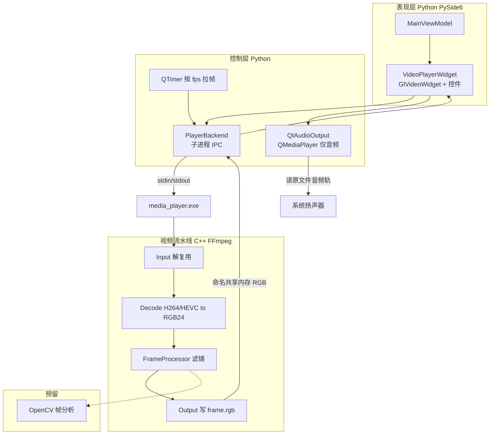

# 音视频处理流程图（项目落地版）

> 对齐当前实现：Python UI → PlayerBackend → `media_player.exe`（FFmpeg）  
> **调用链 / IPC / FFmpeg 详解：** [player_decode_flow.md](../design/player_decode_flow.md)

架构示意（可选）：[流程图.png](流程图.png)

## 总体数据流

```mermaid
flowchart TB
    subgraph UI["表现层 Python PySide6"]
        Widget["VideoPlayerWidget\nGlVideoWidget + 控件"]
        VM["MainViewModel"]
    end

    subgraph CTRL["控制层 Python"]
        Backend["PlayerBackend\n子进程 IPC"]
        QtAudio["QtAudioOutput\nQMediaPlayer 仅音频"]
        Timer["QTimer 按 fps 拉帧"]
    end

    subgraph VIDEO["视频流水线 C++ FFmpeg"]
        Input["Input 解复用"]
        Decode["Decode H264/HEVC to RGB24"]
        Process["FrameProcessor 滤镜"]
        Output["Output 写 frame.rgb"]
    end

    subgraph RESERVE["预留"]
        OpenCVExtra["OpenCV 帧分析"]
    end

    Widget --> Backend
    Widget --> QtAudio
    VM --> Widget
    Timer --> Backend
    Backend -->|stdin/stdout| PlayerExe["media_player.exe"]
    PlayerExe --> Input --> Decode --> Process --> Output
    Process -.-> OpenCVExtra
    Output -->|命名共享内存 RGB| Backend --> Widget
    QtAudio -->|读原文件音频轨| Speaker["系统扬声器"]
```

## 分层职责

| 层级 | 技术 | 职责 |
|------|------|------|
| 表现层 | PySide6 | 进度条、按钮、`GlVideoWidget` 显示 RGB 帧 |
| 控制层 | Python | 播放状态、seek、定时拉帧、音视频 seek 同步 |
| 视频解码 | C++ FFmpeg | 解封装、解码、swscale → RGB24 |
| 音频播放 | Qt Multimedia | 系统解码音频轨，不经过 C++ |
| 处理 | FrameProcessor | OpenCV 滤镜（可关）；分析能力预留 |

## 数据存放（摘要）

| 类型 | 存放位置 | 格式 |
|------|----------|------|
| 视频帧 | 命名共享内存 `MusicEditing_rgb_*`（首选） | 裸 RGB24 |
| 视频帧（回退） | `%TEMP%\me_player_*\frame.rgb` | 裸 RGB24，每帧覆盖 |
| UI 图像 | Python QImage / OpenGL 纹理 | 内存 |
| 音频 | 不落地 | Qt 内部 PCM → 声卡 |

## 统一播放器

全应用共用 **`VideoPlayerWidget`**：

- 首页预览
- 智能切片页导入后自动同步加载
- 打开视频 → `ViewModel.import_video`

IPC 命令与响应协议见 [player_decode_flow.md §6](../design/player_decode_flow.md)。

## 退出清理

关闭主窗口时：`QTimer.stop` → Qt 音频 `stop` → `kill media_player.exe` → `QApplication.quit`（详见播放器专文）。
